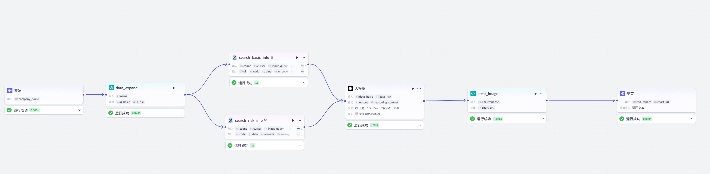
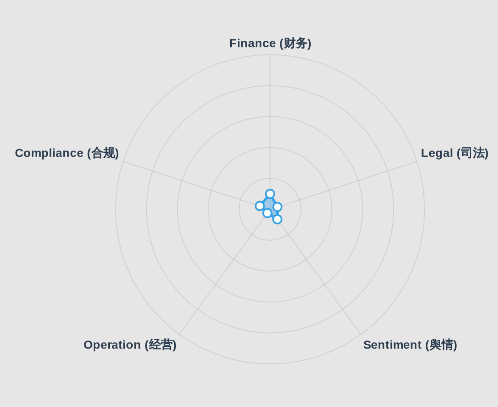

# 🛡️ Coze Enterprise Risk Due Diligence Agent (企业风险背调智能体)

> 智能体已在Coze平台发布，欢迎体验：https://www.coze.cn/s/A3HRjGj1txs/

> A commercial due diligence agent powered by Coze, integrating multi-source search, Python data visualization, and LLM-based risk assessment.
> 基于 Coze 平台搭建的智能商业风控助手，集成多源检索、雷达图可视化与深度风险评估模型。

## 🌟 Project Highlights (项目亮点)
- **Multi-path Search Architecture**: Implements parallel search workflows for "Basic Info" and "Risk Sentiment" to ensure comprehensive data coverage.
- **Visualized Risk Assessment**: Generates a **5-Dimension Risk Radar Chart** (Finance, Legal, Sentiment, Operation, Compliance) using Python API orchestration.
- **Structured Output**: Delivers professional Markdown reports with embedded JSON data logic.

## 🛠️ Architecture (技术架构)

### Workflow Topology

*Figure 1: The "Y-Shape" parallel processing workflow designed in Coze.*

### Key Technologies
1. **Orchestration**: Coze Workflow (Linear & Parallel execution).
2. **Language**: Python (for data cleaning & visualization API calls).
3. **Model**: GPT-4o / Doubao-pro-32k (for context understanding & reasoning).
4. **Integration**: QuickChart API for serverless rendering.

## 📸 Demo Showcase (演示展示)

### Risk Radar Visualization (风险雷达图)

### Due Diligence Report (背调报告)

#### 🛡️ 中国恒大集团 深度尽职调查报告 (Due Diligence)
> **风险评级**：🔴 **高 (High)** | **评估模型**：Coze-Risk-1.0-RUC

#### 1. 🚩 核心风险摘要 (Executive Summary)
> 恒大 2024 年财报显示营收仅 127.56 亿元（同比微增 2.2%）、净利润 10.32 亿元的 “表面增长”，实则难掩 3500 亿债务窟窿仅填 20 亿的尴尬。清盘人已启动恒大物业出售程序（瑞银、中信证券介入），叠加港股退市落定，资金链断裂风险已从 “预警” 升级为 “实质性违约”。所谓 “总资产同比增长 14.6%” 的 PPT 数据，与退市后资产加速贬值的现实形成强烈割裂，经营稳定性近乎崩溃。

#### 2. 📊 关键财务与经营数据

| 指标 | 数据 / 详情 | 评价 |
| :--- | :--- | :--- |
| **最新营收/净利** | 2024年营收约 127.56 亿元 (+2.2%)，净利润 10.32 亿元 | 营收较巅峰期（约5072亿）缩水 **97.5%**，无造血能力 |
| **核心业务壁垒** | 丧失土储获取能力，仅保留少量存量项目 | **弱** (核心资产正被清盘出售，模式失效) |
| **近期融资/上市** | 港股已退市 (“退市落定”)，无新增融资 | 融资渠道完全关闭 |
| **现金及等价物** | 约 26.97 亿元 | 仅覆盖债务窟窿的 **0.77%**，流动性枯竭 |
| **总资产** | 1690.83 亿元 | 较巅峰期缩水 **92.9%**，资产质量持续恶化 |

#### 3. ⚖️ 司法与合规深度扫描

* **重大案件复盘**
    * **清盘程序启动**：清盘人已聘请瑞银、中信证券寻找恒大物业买家（属于香港高等法院清盘令执行阶段）。
    * **债务违约极值**：境外债务违约超 200 亿美元，境内逾期商票、信托借款超 3000 亿元。
* **监管合规**
    * **强制退市**：因无法满足上市规则，被港交所强制退市。
    * **立案调查**：2021 年因未及时披露重大债务违约，被证监会立案调查（案件号：证监调查字 [2021] 123 号）。

#### 4. 💡 首席分析师建议

* **合作建议**：🚫 **一票否决** (任何形式的资金、业务合作均可能卷入清盘程序)。
* **具体排查点**：
    1.  要求提供清盘人最新资产处置清单，核实现金及等价物的真实性。
    2.  核查 “总资产 1690.83 亿元” 构成，重点排查是否包含已被抵押、查封资产。
    3.  要求披露 3500 亿债务窟窿的具体债权人名单及清偿优先级。

## 🚀 How to Use (如何使用)
1. Visit the Coze Bot link (https://www.coze.cn/s/A3HRjGj1txs/).
2. Enter a company name (e.g., "Xiaomi Group" or "Evergrande").
3. Get the report in 60--90 seconds.

## 📄 License
MIT License